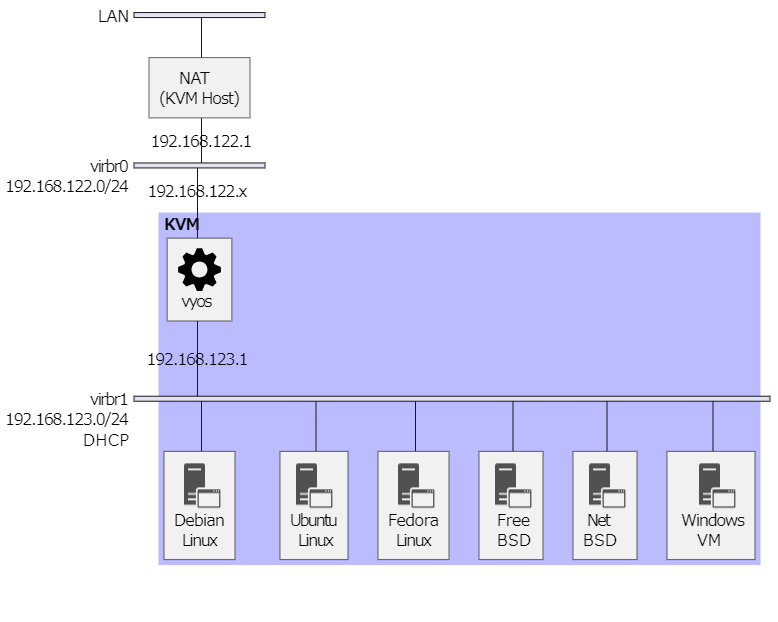

KVM 環境準備
===

## 仮想化支援機能の確認

仮想化支援機能は仮想化ソフトウェアが行う処理の一部を CPU が負担することで仮想マシン処理を高速化する機能で、Intel CPU の場合 `Intel-VT`、AMD CPU の場合 `AMD-V` が仮想化支援機能に相当していて、最近の PC であればたいてい対応しています。

- 仮想化支援機能対応 CPU の確認方法

    ```bash
    egrep -c '(vmx|svm)' /proc/cpuinfo
    ```

    大体の場合は 0 以上の値が出力されると思います。


## インストール

- Ubuntu Linux 24.04

    ```bash
    sudo apt install -y \
        qemu-kvm libvirt-daemon-system libvirt-clients \
        bridge-utils virtinst libosinfo-bin
    ```

    - qemu-kvm  
      KVM を実行するために必要な QEMU パッケージらしい。  
      qemu-kvm というパッケージがインストールされるのではなく、マシンに合わせた QEMU のパッケージを選んでくれる。

    - libvirt-daemon-system、libvirt-clients  
      仮想化アプリケーション、ハイパーバイザーを抽象的に操作できるようにするlibvirtのパッケージ

    - bridge-utils  
      ブリッジを構成・設定するパッケージ

    - virtinst  
      CUI で仮想マシンの操作をするのに必要なパッケージ

    - libosinfo-bin  
      virt-install コマンドで --os-variant オプションを使用するために必要なパッケージ


### 設定

- ユーザアカウント

    KVM を利用するユーザは libvirt グループと kvm グループに所属させ、KVM の捜査権限を付与します。

    ユーザーのlibvirtグループへの追加: libvirtグループにユーザーを追加して、仮想マシンの管理権限を付与します。

    ```bash
    sudo usermod -aG libvirt,kvm UserID
    ```

    追加したグループは、再度ログインするときに有効になります。

- libvirt の起動設定・動作確認

    ```bash
    sudo systemctl enable libvirtd
    sudo systemctl start libvirtd
    sudo systemctl status libvirtd
    ```

### 仮想ネットワーク作成

apt で KVM をインストールすると、デフォルトで KVM ホストを NAT とする仮想ネットワーク `virbr0` が作成されます。  
ここでは、下記図のような仮想ネットワークを作成します。



1. 仮想ネットワーク定義ファイル (とりあえずここでは virbr1.xml) の作成

    ```xml
    <network>
        <name>virbr1</name>
        <domain name="network" />
    </network>
    ```

2. 仮想ネットワークの登録

    ```bash
    virsh net-define ./virbr1.xml
    ```

3. 仮想ネットワークの自動起動設定

    ```bash
    virsh net-autostart virbr1
    ```

4. 仮想ネットワークの起動

    ```bash
    virsh net-start virbr1
    ```

    ここまでやると `ip address show` に `virbr1` が表示されるようになります。  
    設定ミスった、と思ったら、

    ```bash
    virsh net-destroy virbr1
    ```

    を実行すると、最初から設定をやり直せます。使い方を知っていれば `net-edit` の方が手軽だと思います。
